# 📏 Size Calculator — Calcolatore Taglie

**🇮🇹 [Italiano](#-italiano) · 🇬🇧 [English](#-english)**

---

# 🇮🇹 Italiano

App Android per calcolare la taglia di **reggiseno, maglie, vestiti, pantaloni, scarpe e bambini**. Funziona completamente offline, con conversioni internazionali IT/EU/UK/US e sistema SMART.

[](https://www.android.com)
[](https://github.com/maxsassano/SizeCalculator/releases)
[](LICENSE)

---

## ✨ Funzionalità

- **6 categorie in un'unica app**: reggiseno, maglie, vestiti, pantaloni, scarpe, bambini
- **Reggiseno**: metodo SEMPLICE (2 misure) e metodo PRECISO (6 misure ABTF)
- **Altre categorie**: calcolo taglia basato su torace, vita, fianchi, cavallo, lunghezza piede, altezza
- **Convertitore di taglie** universale: da una taglia a tutte le altre (IT, EU, UK, US, SMART)
- **Tabelle taglie** per ogni categoria, con misure in cm
- **Guide passo-passo** per prendere correttamente le misure
- **Conversioni internazionali**: 🇮🇹 IT · 🇪🇺 EU · 🇫🇷 FR · 🇩🇪 DE · 🇬🇧 UK · 🇺🇸 US · 📏 SMART
- **Multilingua**: italiano + inglese (automatico in base alla lingua del telefono)
- **Profilo utente**: salva le tue misure e riutilizzale in tutti i calcoli
- **Privacy totale**: funziona completamente offline, nessun dato inviato

---

## 📸 Screenshot

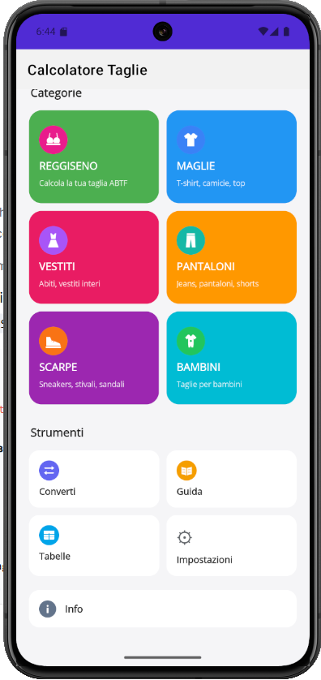

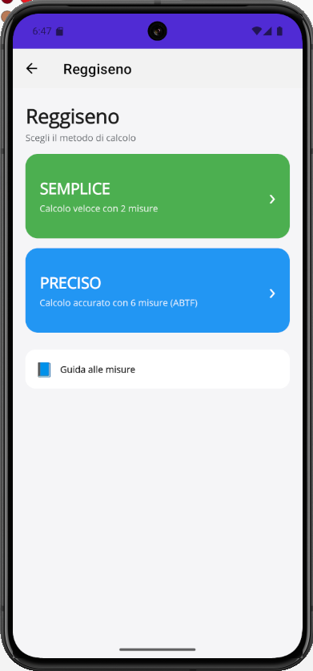
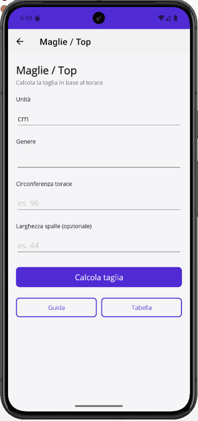
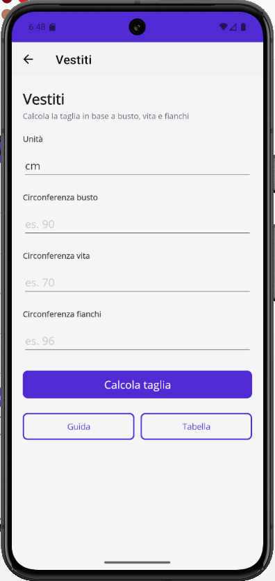
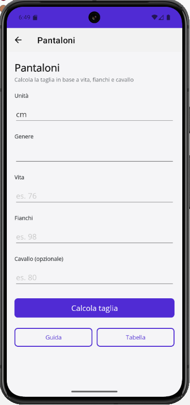
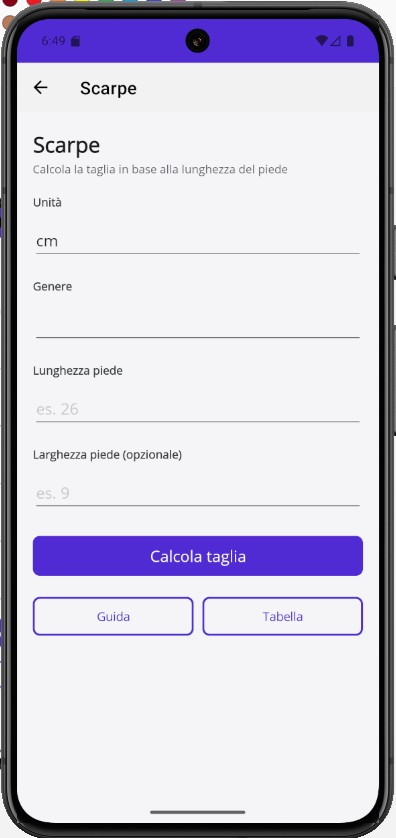
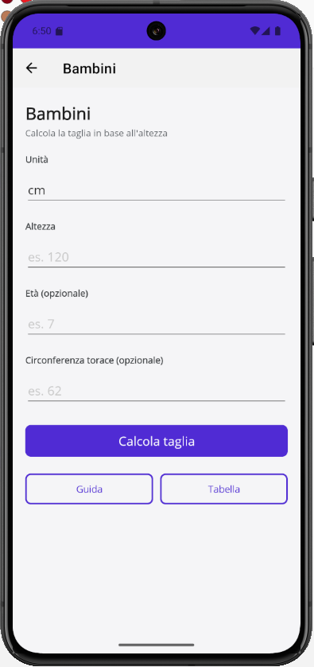

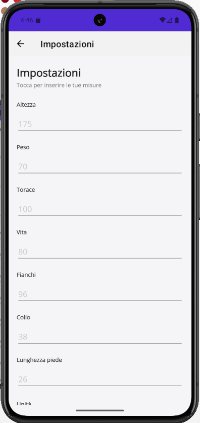
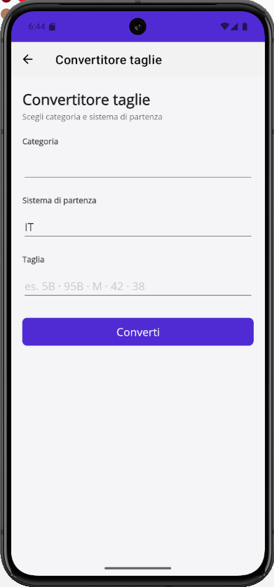
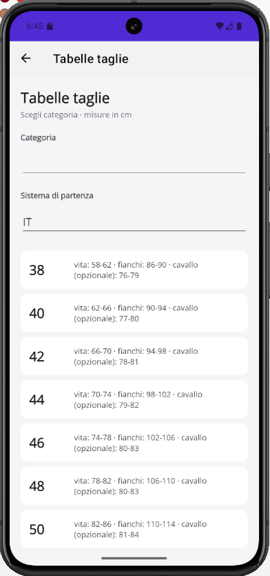
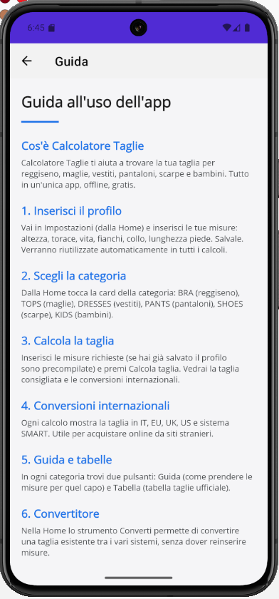
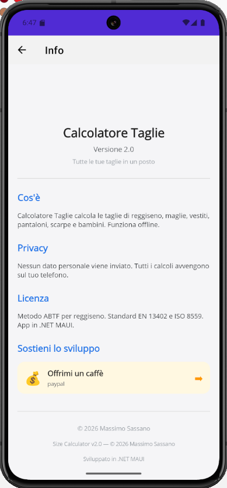

---

## 📥 Download

👉 [**Scarica l'ultima versione**](https://github.com/maxsassano/SizeCalculator/releases/latest)

**Requisiti:** Android 7.0 (API 24) o superiore

**Installazione:**
1. Scarica `SizeCalculator.apk` sul telefono
2. Impostazioni → Sicurezza → Origini sconosciute (attiva)
3. Apri l'APK → Installa

---

## 🚀 Come si usa

### 1. Imposta il tuo profilo
Vai in **Impostazioni** dalla Home e inserisci le tue misure (altezza, torace, vita, fianchi, collo, lunghezza piede). Verranno salvate e riutilizzate automaticamente in tutti i calcoli.

### 2. Scegli la categoria
Dalla Home tocca la card della categoria:
- 👙 **BRA** — Reggiseno
- 👕 **TOPS** — Maglie, camicie, t-shirt
- 👗 **DRESSES** — Vestiti, abiti
- 👖 **PANTS** — Pantaloni, jeans, shorts
- 👟 **SHOES** — Scarpe
- 🧒 **KIDS** — Bambini

### 3. Calcola la taglia
Inserisci le misure richieste (se hai già salvato il profilo sono precompilate) e premi **Calcola taglia**.

### 👙 Reggiseno — 2 metodi
- **SEMPLICE**: 2 misure (sottoseno + seno), calcolo rapido
- **PRECISO**: 6 misure ABTF (loose, snug, tight, standing, leaning, lying), con variante specifica per persone AMAB

### 🔧 Convertitore
Inserisci la tua taglia attuale (es. `95B`, `M`, `42`) e scegli il sistema. L'app mostra immediatamente la conversione in **tutti i sistemi**. Perfetto per acquisti online.

### 📊 Tabelle
Per ogni categoria, una tabella completa con taglie e misure in cm.

### 📘 Guida
Istruzioni passo-passo con immagini per prendere le misure correttamente.

---

## 📊 Esempio conversioni reggiseno

**Fascia (sottoseno)**

| IT | SMART | EU | FR/ES | DE | UK | US |
|----|----|----|----|----|----|----|
| 0 | 1 | 65 | 80 | 65 | 30 | 30 |
| 1 | 1 | 70 | 85 | 70 | 32 | 32 |
| 2 | 1 | 75 | 90 | 75 | 34 | 34 |
| 3 | 2 | 80 | 95 | 80 | 36 | 36 |
| 4 | 3 | 85 | 100 | 85 | 38 | 38 |
| 5 | 4 | 90 | 105 | 90 | 40 | 40 |
| 6 | 4 | 95 | 110 | 95 | 42 | 42 |
| 7 | 5 | 100 | 115 | 100 | 44 | 44 |
| 8 | 5 | 105 | 120 | 105 | 46 | 46 |

**Coppa**

| IT | EU | FR | DE | UK | US |
|----|----|----|----|----|----|
| A | A | A | A | A | A |
| B | B | B | B | B | B |
| C | C | C | C | C | C |
| D | D | D | D | D | D |
| E | E | E | E | DD | DD/E |
| F | F | F | F | E | DDD/F |
| G | G | G | G | F | G |
| H | H | H | H | FF | H |

---

## 🔒 Privacy

- ✅ Nessuna registrazione richiesta
- ✅ Nessun dato personale raccolto
- ✅ Nessuna connessione internet
- ✅ Tutti i calcoli avvengono sul tuo telefono
- ✅ Zero pubblicità

---

## 📋 Changelog

### v1.0 — 7 ottobre 2026
- ✨ Prima release pubblica
- ✨ 6 categorie: reggiseno, maglie, vestiti, pantaloni, scarpe, bambini
- ✨ Reggiseno: metodo Semplice (2 misure) + Preciso (6 misure ABTF)
- ✨ Convertitore universale con tutte le conversioni
- ✨ Tabelle taglie per ogni categoria
- ✨ Guide passo-passo con immagini
- ✨ Profilo utente salvato
- ✨ Multilingua IT/EN
- ✨ Privacy garantita (offline)

---

## 📄 Licenza

MIT — vedi [LICENSE](LICENSE)

---

## ☕ Sostieni il progetto

[](https://paypal.me/veruscatanese)

Ogni contributo aiuta a mantenere il progetto attivo e senza pubblicità. Grazie! 🙏

---

## 🙏 Crediti

- **Metodologia reggiseno**: A Bra That Fits (ABTF), community open source
- **Standard**: EN 13402, ISO 8559, ASTM D 5219 / D 5586
- **Sviluppo**: Massimo Sassano — .NET MAUI + C# 12

---

<p align="center">
  <b>Size Calculator v1.0</b><br>
  © 2026 Massimo Sassano<br>
  Made with ❤️ in Italia
</p>

---
---

# 🇬🇧 English

Android app to calculate sizes for **bras, tops, dresses, pants, shoes and kids**. Works completely offline, with international conversions IT/EU/UK/US and SMART system.

[](https://www.android.com)
[](https://github.com/maxsassano/SizeCalculator/releases)
[](LICENSE)

---

## ✨ Features

- **6 categories in one app**: bra, tops, dresses, pants, shoes, kids
- **Bra**: SIMPLE method (2 measurements) and PRECISE method (6 ABTF measurements)
- **Other categories**: size calculation based on bust, waist, hips, inseam, foot length, height
- **Universal size converter**: from one size to all others (IT, EU, UK, US, SMART)
- **Size charts** for every category, with measurements in cm
- **Step-by-step guides** to take measurements correctly
- **International conversions**: 🇮🇹 IT · 🇪🇺 EU · 🇫🇷 FR · 🇩🇪 DE · 🇬🇧 UK · 🇺🇸 US · 📏 SMART
- **Multilingual**: Italian + English (auto based on phone language)
- **User profile**: save your measurements and reuse them in all calculations
- **Total privacy**: works completely offline, no data sent

---

## 📸 Screenshots

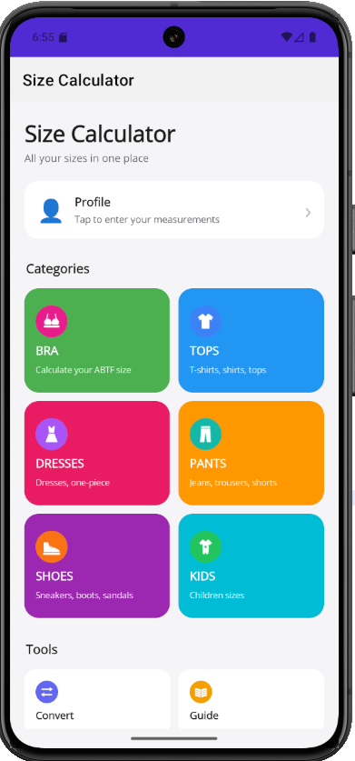

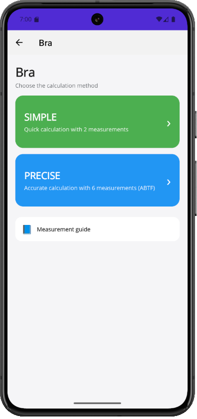
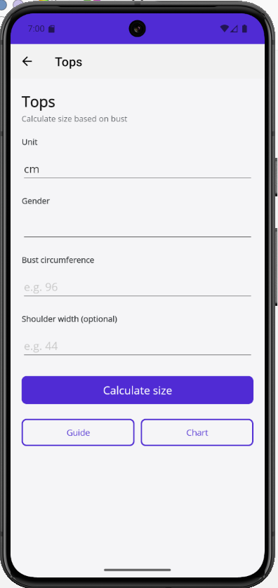
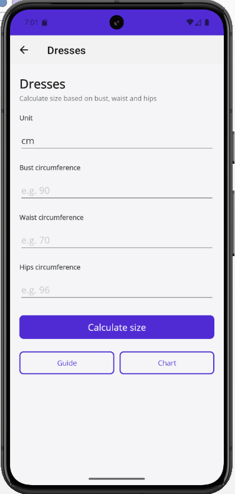
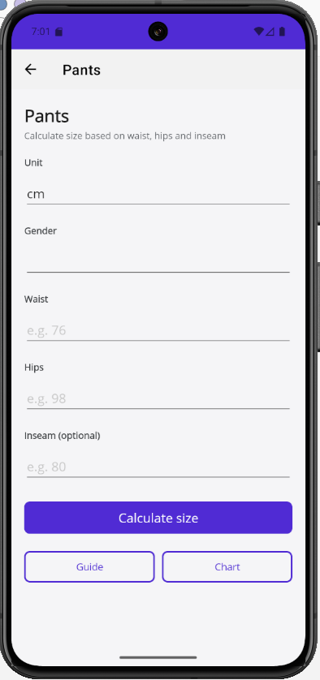
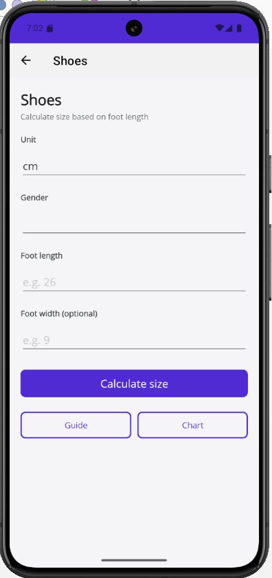
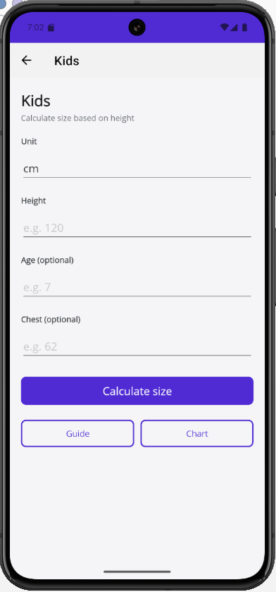

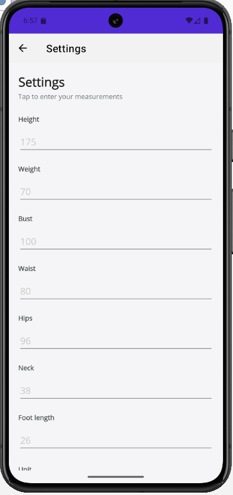
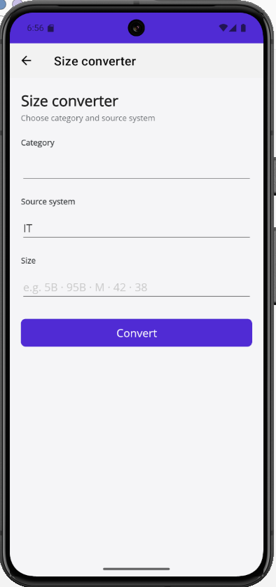
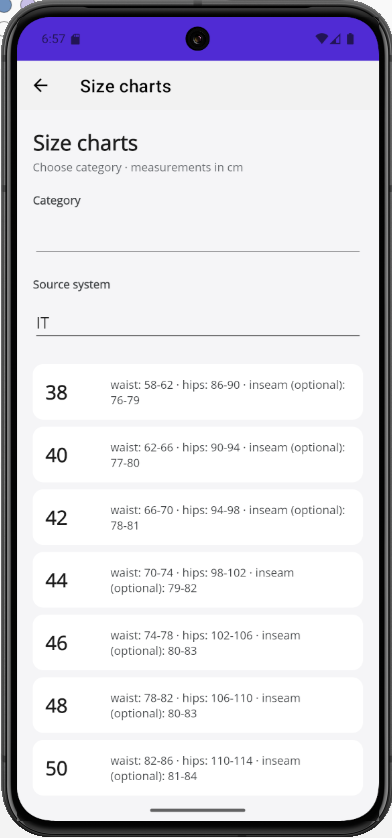
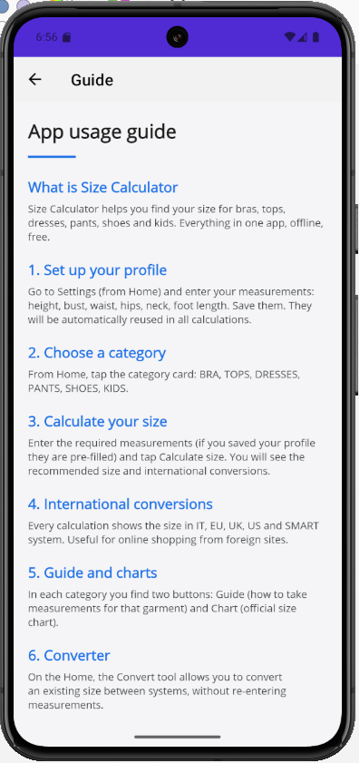
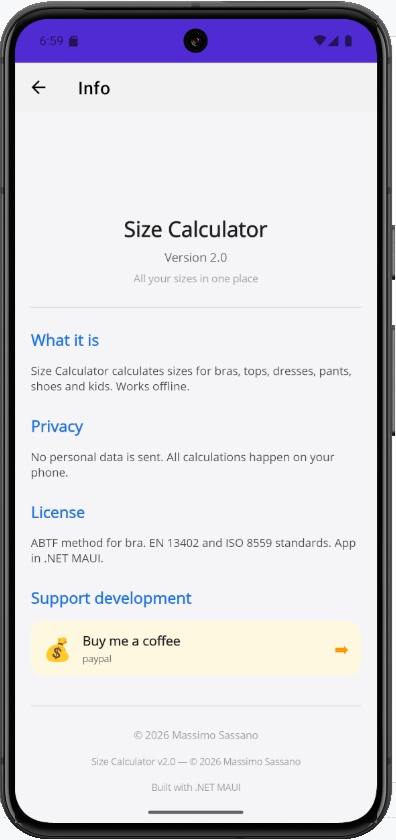

---

## 📥 Download

👉 [**Download the latest version**](https://github.com/maxsassano/SizeCalculator/releases/latest)

**Requirements:** Android 7.0 (API 24) or higher

**Installation:**
1. Download `SizeCalculator.apk` on your phone
2. Settings → Security → Unknown sources (enable)
3. Open the APK → Install

---

## 🚀 How to use

### 1. Set up your profile
Go to **Settings** from Home and enter your measurements (height, bust, waist, hips, neck, foot length). They will be saved and automatically reused in all calculations.

### 2. Choose a category
From Home, tap the category card:
- 👙 **BRA**
- 👕 **TOPS** — T-shirts, shirts, tops
- 👗 **DRESSES**
- 👖 **PANTS** — Jeans, trousers, shorts
- 👟 **SHOES**
- 🧒 **KIDS**

### 3. Calculate your size
Enter the required measurements (pre-filled if you saved your profile) and tap **Calculate size**.

### 👙 Bra — 2 methods
- **SIMPLE**: 2 measurements (underbust + bust), quick calculation
- **PRECISE**: 6 ABTF measurements (loose, snug, tight, standing, leaning, lying), with specific variant for AMAB people

### 🔧 Converter
Enter your current size (e.g. `95B`, `M`, `42`) and choose the source system. The app shows the conversion in **all systems**. Perfect for online shopping.

### 📊 Charts
For every category, a complete chart with sizes and measurements in cm.

### 📘 Guide
Step-by-step instructions with images to take measurements correctly.

---

## 📊 Bra conversion example

**Band (underbust)**

| IT | SMART | EU | FR/ES | DE | UK | US |
|----|----|----|----|----|----|----|
| 0 | 1 | 65 | 80 | 65 | 30 | 30 |
| 1 | 1 | 70 | 85 | 70 | 32 | 32 |
| 2 | 1 | 75 | 90 | 75 | 34 | 34 |
| 3 | 2 | 80 | 95 | 80 | 36 | 36 |
| 4 | 3 | 85 | 100 | 85 | 38 | 38 |
| 5 | 4 | 90 | 105 | 90 | 40 | 40 |
| 6 | 4 | 95 | 110 | 95 | 42 | 42 |
| 7 | 5 | 100 | 115 | 100 | 44 | 44 |
| 8 | 5 | 105 | 120 | 105 | 46 | 46 |

**Cup**

| IT | EU | FR | DE | UK | US |
|----|----|----|----|----|----|
| A | A | A | A | A | A |
| B | B | B | B | B | B |
| C | C | C | C | C | C |
| D | D | D | D | D | D |
| E | E | E | E | DD | DD/E |
| F | F | F | F | E | DDD/F |
| G | G | G | G | F | G |
| H | H | H | H | FF | H |

---

## 🔒 Privacy

- ✅ No registration required
- ✅ No personal data collected
- ✅ No internet connection
- ✅ All calculations happen on your phone
- ✅ Zero ads

---

## 📋 Changelog

### v1.0 — October 7, 2026
- ✨ First public release
- ✨ 6 categories: bra, tops, dresses, pants, shoes, kids
- ✨ Bra: Simple method (2 measurements) + Precise (6 ABTF measurements)
- ✨ Universal converter with all conversions
- ✨ Size charts for every category
- ✨ Step-by-step guides with images
- ✨ Saved user profile
- ✨ Multilingual IT/EN
- ✨ Guaranteed privacy (offline)

---

## 📄 License

MIT — see [LICENSE](LICENSE)

---

## ☕ Support the project

[](https://paypal.me/veruscatanese)

Every contribution helps keep the project alive and ad-free. Thank you! 🙏

---

## 🙏 Credits

- **Bra methodology**: A Bra That Fits (ABTF), open source community
- **Standards**: EN 13402, ISO 8559, ASTM D 5219 / D 5586
- **Development**: Massimo Sassano — .NET MAUI + C# 12

---

<p align="center">
  <b>Size Calculator v1.0</b><br>
  © 2026 Massimo Sassano<br>
  Made with ❤️ in Italy
</p>
```

---

# 📄 `LICENSE` (MIT)

Crea il file `LICENSE` nella root del repo con:

```
MIT License

Copyright (c) 2026 Massimo Sassano

Permission is hereby granted, free of charge, to any person obtaining a copy
of this software and associated documentation files (the "Software"), to deal
in the Software without restriction, including without limitation the rights
to use, copy, modify, merge, publish, distribute, sublicense, and/or sell
copies of the Software, and to permit persons to whom the Software is
furnished to do so, subject to the following conditions:

The above copyright notice and this permission notice shall be included in all
copies or substantial portions of the Software.

THE SOFTWARE IS PROVIDED "AS IS", WITHOUT WARRANTY OF ANY KIND, EXPRESS OR
IMPLIED, INCLUDING BUT NOT LIMITED TO THE WARRANTIES OF MERCHANTABILITY,
FITNESS FOR A PARTICULAR PURPOSE AND NONINFRINGEMENT. IN NO EVENT SHALL THE
AUTHORS OR COPYRIGHT HOLDERS BE LIABLE FOR ANY CLAIM, DAMAGES OR OTHER
LIABILITY, WHETHER IN AN ACTION OF CONTRACT, TORT OR OTHERWISE, ARISING FROM,
OUT OF OR IN CONNECTION WITH THE SOFTWARE OR THE USE OR OTHER DEALINGS IN THE
SOFTWARE.
```
